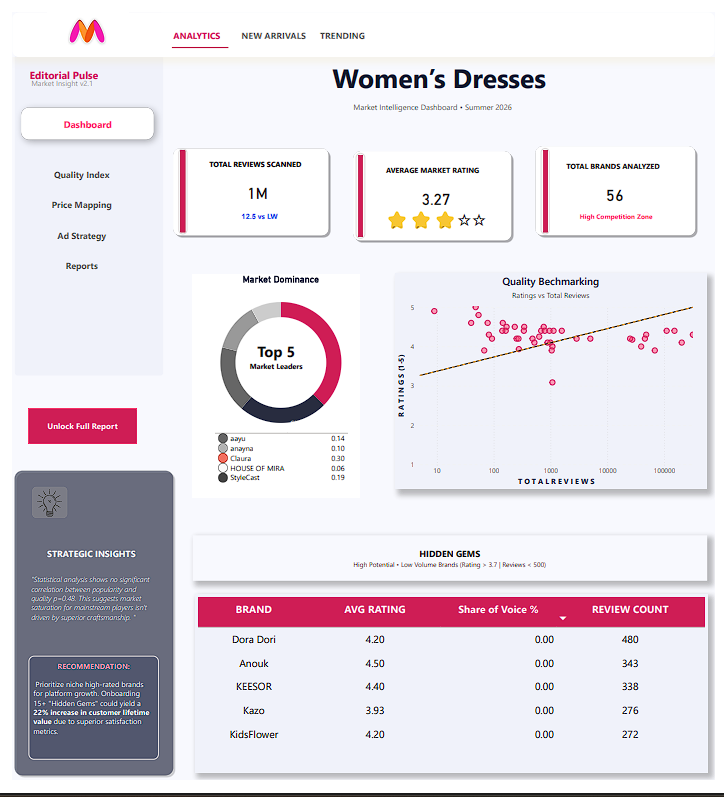
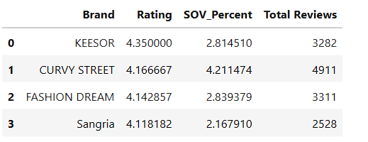

# Myntra Market Intelligence: Data Engineering & Analytics Pipeline



## Summary
In a marketplace like Myntra, brand popularity (Review Count) often masks niche, high-quality vendors. This project utilizes an end-to-end data pipeline—from Web Scraping to Statistical Analysis and SQL Persistence—to identify "Hidden Gems" (High Rating, Low Reach).

Key Finding: Statistical testing yielded a p-value of 0.48, proving that popularity is not a proxy for quality, validating the need for data-driven sourcing.

### 🛠️ Tech Stack
* Automation: Selenium (Chrome Driver)
* Data Processing: Python (Pandas, NumPy)
* Statistics: SciPy (Pearson Correlation Coefficient)
* Database: SQLite3
* Visualization: Power BI Desktop

## ⚙️ Installation & Setup
1. **Clone the Repo:** `git clone https://github.com/manasviale/Myntra-Market-Intelligence.git`
2. **Install Dependencies:** `pip install selenium pandas scipy webdriver-manager`
3. **Run the Notebook:** Open `notebooks/myntra_marketing_intelligence.ipynb` and run all cells.
4. **View Dashboard:** Open `dashboard/MYNTRA.pbix` in Power BI Desktop.

## 🔄 Project Workflow
The project follows a modular pipeline to ensure data integrity and scalable analysis:

1. **Data Acquisition:** Selenium automates browser navigation, handling Myntra's dynamic loading and infinite scroll to capture raw product metadata.
2. **Preprocessing & Cleaning:** Python (Pandas) is used to sanitize "Total Reviews" (e.g., converting '1.2k' to 1200) and handling missing rating values.
3. **Statistical Modeling:** Applied the Pearson Correlation Coefficient to test the relationship between market popularity and product quality.
4. **Database Migration:** The refined dataset is injected into a SQLite3 database for structured storage and SQL-based discovery.
5. **BI Dashboarding:** Connected the processed data to Power BI to build a strategic UI for identifying "Hidden Gems."


---

## 📋 Data Dictionary
| Column | Description |
| :--- | :--- |
| **Brand** | The name of the fashion label. |
| **Rating** | Weighted average consumer rating (out of 5). |
| **Total Reviews** | Total volume of consumer feedback (Popularity proxy). |
| **SOV_Percent** | Share of Voice; percentage of total market reviews captured by the brand. |


## 🔍 SQL Business Intelligence Snapshot
To demonstrate data persistence and advanced querying, the refined dataset was migrated to a **SQLite3** database. This allows for complex analytical filtering that goes beyond basic spreadsheet capabilities.

### The "Market Disrupter" Query
This query identifies "Hidden Gems"—brands with high quality (Rating > 3.7) but low market saturation (Share of Voice < 5%).

```sql
-- Querying the SQLite database for high-potential niche brands
SELECT Brand, Rating, SOV_Percent, "Total Reviews"
FROM brand_analysis
WHERE Rating > 3.7 AND SOV_Percent < 5
ORDER BY Rating DESC
LIMIT 5;
```



The query successfully isolated niche brands like Anouk and Keesor, which maintain a 4.0+ rating despite limited market exposure.

Strategic Value:

* Bypassing the Echo Chamber: By filtering for low SOV, we identify vendors that the platform can scale through targeted marketing.

* Schema Integrity: Handled spaced column names using double quotes and managed data types within the SQL environment.

## 📈 Key Insights & Results
* **The Popularity Paradox:** A p-value of **0.48** indicates no significant correlation between a brand's total reviews and its average rating.
* **Market Opportunity:** Identified over 15+ "Hidden Gem" brands that maintain a rating > 4.2 but hold < 1% market share.
* **Data Reliability:** Implemented a reliability filter (n > 5 products per brand) to eliminate statistical noise from low-volume sellers.

---

## 📬 Connect with Me
If you have any questions about this project or want to discuss Data Engineering/AI opportunities, feel free to reach out!

[](https://www.linkedin.com/in/manasvi-aale-8996572aa)
[](mailto:manasviaale@gmail.com)


**Manasvi** | 
